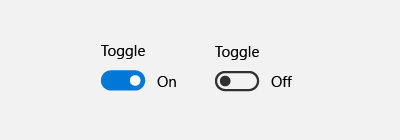
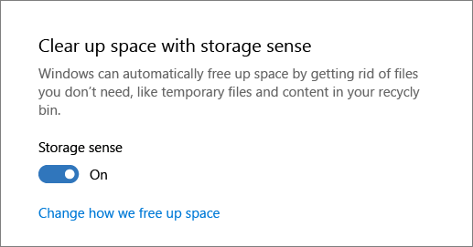

# Toggle switches
<link rel="stylesheet" href="https://az835927.vo.msecnd.net/sites/uwp/Resources/css/custom.css">

The [toggle switch](https://msdn.microsoft.com/library/windows/apps/windows.ui.xaml.controls.toggleswitch.aspx) represents a physical switch that allows users to turn things on or off, like a light switch. Use toggle switch controls to present users with two mutually exclusive options (such as on/off), where choosing an option provides immediate results. 

To create a toggle switch control, you use the  [ToggleSwitch class](https://msdn.microsoft.com/library/windows/apps/windows.ui.xaml.controls.toggleswitch.aspx).

> **Important APIs**: [ToggleSwitch class](https://msdn.microsoft.com/library/windows/apps/windows.ui.xaml.controls.toggleswitch.aspx), [IsOn property](https://msdn.microsoft.com/library/windows/apps/windows.ui.xaml.controls.toggleswitch.ison.aspx), [Toggled event](https://msdn.microsoft.com/library/windows/apps/windows.ui.xaml.controls.toggleswitch.toggled.aspx)


## Is this the right control?

Use a toggle switch for binary operations that take effect right after the user flips the toggle switch.



Think of the toggle switch as a physical power switch for a device: you flip it on or off when you want to enable or disable the action performed by the device.

To make the toggle switch easy to understand, label it with one or two words, preferably nouns, that describe the functionality it controls. For example, "WiFi" or "Kitchen lights."  


### Choosing between toggle switch and check box

For some actions, either a toggle switch or a check box might work. To decide which control would work better, follow these tips:

-   Use a toggle switch for binary settings when changes become effective immediately after the user changes them.

    

    In this example, it's clear with the toggle switch that the wireless is set to "On." But with the checkbox, the user needs to think about whether the wireless is on now or whether they need to check the box to turn wireless on.

-   Use check boxes for optional ("nice to have") items. 
-   Use a checkbox when the user has to perform extra steps for changes to be effective. For example, if the user must click a "submit" or "next" button to apply changes, use a check box.
-   Use check boxes when the user can select multiple items that are related to a single setting or feature. 

## Toggle switches in the the Windows UI

These images show how the Windows UI uses toggle switches. Here's how the Smart Storage Settings screen uses toggle switches:



This example is from the Night Light Settings page:


## Create a toggle switch

Here's how to create a simple toggle switch. This XAML creates the WiFi toggle switch shown previously.

```xaml
<ToggleSwitch x:Name="wiFiToggle" Header="Wifi"/>
```
Here's how to create the same toggle switch in code.

```csharp
ToggleSwitch wiFiToggle = new ToggleSwitch();
wiFiToggle.Header = "WiFi";

// Add the toggle switch to a parent container in the visual tree.
stackPanel1.Children.Add(wiFiToggle);
```

### IsOn

The switch can be either on or off. Use the [IsOn](https://msdn.microsoft.com/library/windows/apps/windows.ui.xaml.controls.toggleswitch.ison.aspx) property to determine the state of the switch. When the switch is used to control the state of another binary property, you can use a binding as shown here.

```
<StackPanel Orientation="Horizontal">
    <ToggleSwitch x:Name="ToggleSwitch1" IsOn="True"/>
    <ProgressRing IsActive="{x:Bind ToggleSwitch1.IsOn, Mode=OneWay}" Width="130"/>
</StackPanel>
```

### Toggled

In other cases, you can handle the [Toggled](https://msdn.microsoft.com/library/windows/apps/windows.ui.xaml.controls.toggleswitch.toggled.aspx) event to respond to changes in the state.

This example shows how to add a Toggled event handler in XAML and in code. The Toggled event is handled to turn a progress ring on or off, and change its visibility.

```xaml
<ToggleSwitch x:Name="toggleSwitch1" IsOn="True"
              Toggled="ToggleSwitch_Toggled"/>
```

Here's how to create the same toggle switch in code.

```csharp
// Create a new toggle switch and add a Toggled event handler.
ToggleSwitch toggleSwitch1 = new ToggleSwitch();
toggleSwitch1.Toggled += ToggleSwitch_Toggled;

// Add the toggle switch to a parent container in the visual tree.
stackPanel1.Children.Add(toggleSwitch1);
```

Here's the handler for the Toggled event.

```csharp
private void ToggleSwitch_Toggled(object sender, RoutedEventArgs e)
{
    ToggleSwitch toggleSwitch = sender as ToggleSwitch;
    if (toggleSwitch != null)
    {
        if (toggleSwitch.IsOn == true)
        {
            progress1.IsActive = true;
            progress1.Visibility = Visibility.Visible;
        }
        else
        {
            progress1.IsActive = false;
            progress1.Visibility = Visibility.Collapsed;
        }
    }
}
```

### On/Off labels

By default, the toggle switch includes literal On and Off labels, which are localized automatically. You can replace these labels by setting the [OnContent](https://msdn.microsoft.com/library/windows/apps/windows.ui.xaml.controls.toggleswitch.oncontent.aspx), and [OffContent](https://msdn.microsoft.com/library/windows/apps/windows.ui.xaml.controls.toggleswitch.offcontent.aspx) properties.

This example replaces the On/Off labels with Show/Hide labels.  

```xaml
<ToggleSwitch x:Name="imageToggle" Header="Show images"
              OffContent="Show" OnContent="Hide"
              Toggled="ToggleSwitch_Toggled"/>
```

You can also use more complex content by setting the [OnContentTemplate](https://msdn.microsoft.com/library/windows/apps/windows.ui.xaml.controls.toggleswitch.oncontenttemplate.aspx) and [OffContentTemplate](https://msdn.microsoft.com/library/windows/apps/windows.ui.xaml.controls.toggleswitch.offcontenttemplate.aspx) properties.

## Recommendations

-	Use the default On and Off labels when you can; only replace them when it's necessary for the toggle switch to make sense. If you replace them, use a single word that more accurately describes the toggle. In general, if the words "On" and "Off" don't describe the action tied to a toggle switch, you might need a different control.
-	Avoid replacing the On and Off labels unless you must; stick with the default labels unless the situation calls for custom ones.


## Related articles

- [ToggleSwitch class](https://msdn.microsoft.com/library/windows/apps/hh701411)
- [Radio buttons](radio-button.md)
- [Toggle switches](toggles.md)
- [Check boxes](checkbox.md)
