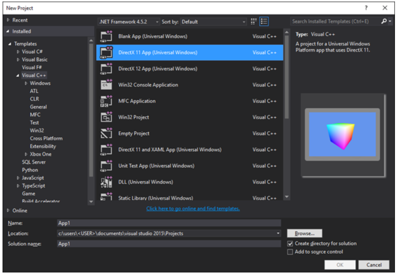
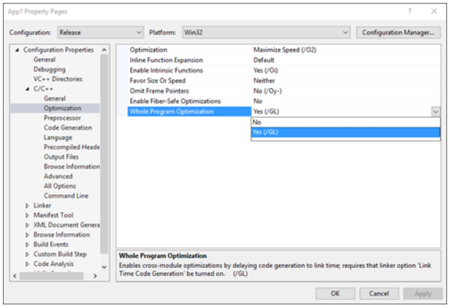
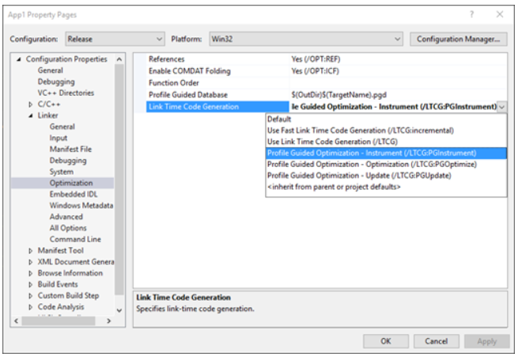
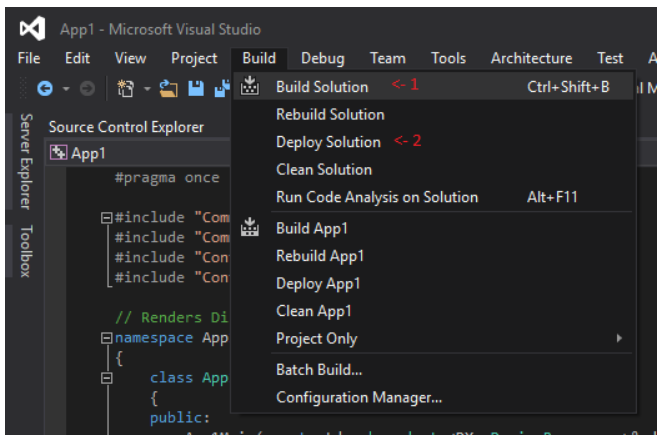
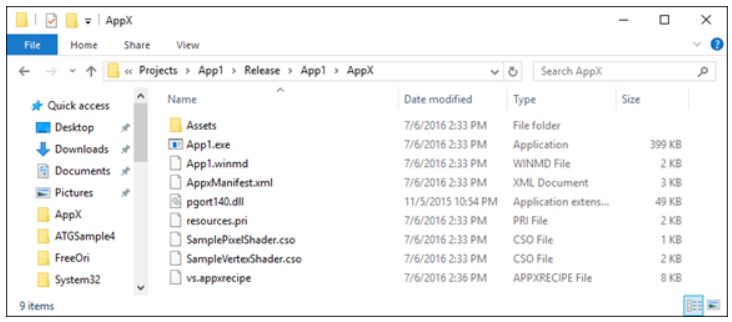
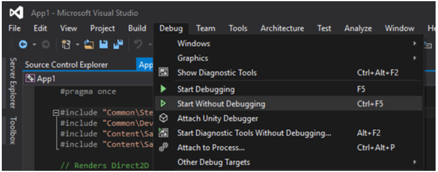
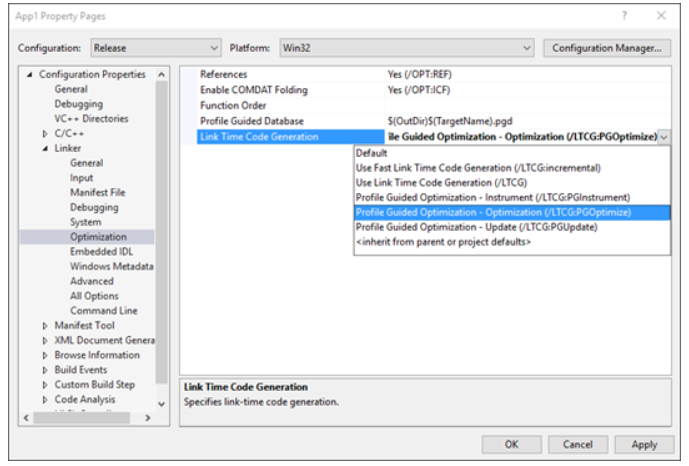

# Running Profile Guided Optimization on Universal Windows Platform apps 
 
This topic provides a step-by-step guide to applying Profile Guided Optimization (PGO) to Universal Windows Platform (UWP) apps. Not all of the steps available to classic win32 applications are available to UWP apps, so our goal is to explain the process necessary to incorporate PGO to make optimizing easier and more accessible to UWP developers.

The following is a basic walkthrough of applying PGO to the default DirectX 11 app (UWP) template by using Visual Studio 2015 Update 3.
 
The screenshots throughout this guide are based on the following new project:


To apply PGO to the DirectX 11 app template:

1. Set your solution configuration to **Release** or choose a solution configuration where you are generating optimized code intended for release. While you could theoretically run PGO on a debug build, it would be ineffective to use PGO to optimize an otherwise unoptimized build. 
 
 
 
2. Verify in your project’s properties (**Properties** > **C/C++** > **Optimization**) that you are building with the /GL flag for **Whole Program Optimization** (this may already be set by your configuration).

 

3. Go into your linker properties (**Properties** > **Linker** > **Optimization**) and set **Link Time Code Generation** to **Profile Guided Optimization - Instrument (LTCG:PGInstrument)**.
 
 

4. Select **Build Solution**, and then select **Deploy Solution**. 

 
 
 You can double check that everything has worked properly by looking at the build output location and verifying that a .pgd file has been generated. In this example case, this meant that the following file was generated alongside the build output:
 
 `C:\Users\<USER>\Documents\Visual Studio 2015\Projects\App1\Release\App1\App1.pgd`

 By default, the .pgd file will have the same name as your executable. You can also change the name of the .pgd file that is generated by changing the **Profile Guided Database** linker option. 
 
5. Navigate to your Visual Studio VC binaries directory (by default this looks like `C:\Program Files (x86)\Microsoft Visual Studio 14.0\VC\bin`). For x86 executables, copy `pgort140.dll`; for x64 executables, copy the x64 version from `amd64\pgort140.dll`. Paste the appropriate version of `pgort140.dll` into the root of your deployed package. For this sample the path is:

 `C:\Users\<USER>\Documents\Visual Studio 2015\Projects\App1\Release\App1\AppX\`

 This step is necessary because UWP apps can only load libraries that exist within their package.

 
 
6. Run the app either from the Start menu or from the Visual Studio **Debug** menu with the **Start Without Debugging** option. 

 
 
7. The build that is now running is instrumented and generating PGO data. At this point, you should run the application through some of the most common scenarios that you intend to optimize. After the program has run through the intended scenarios, find the pgosweep.exe tool located in the same folder where you found the appropriate version of `pgort140.dll`. Alternately, a Visual Studio (x86/x64) Native Tools command prompt will already have the appropriate version in its path. To gather the PGO data, run the following command while the application is still running to generate a .pgc file that will contain the profiling data:
 
  `pgosweep.exe <executable name> <output file>` 
 
  You can also look at the pgosweep.exe help (`pgosweep.exe /help`) to view other optional arguments for controlling the way you gather PGO data.
 
  It is a good idea to output the .pgc files into the build location where the .pgd is located, and also to name the files `<PGDName>!<RunIdentifier>.pgc`. For this example, this meant:
 
  ```
  pgosweep.exe App1.exe “C:\Users\<USER>\Documents\Visual Studio 2015\Projects\App1\Release\App1\App1!1.pgc”
  ```
 
  Further gathering could also be `App1!CoreScenario.pgc`, `App1!UseCase5.pgc`, etc. If the .pgc files are named in this way and in the build output location alongside the .pgd, they will be automatically merged when linking in step 9.
 
8. OPTIONAL: By default, all .pgc files named as specified in step 7 and placed next to the .pgd will be merged when linking and weighted equally, but you can also have greater control over how particular runs are weighted. To do this, you will use the **pgomgr.exe** tool also located in the same folder where you first found the copy of `pgort140.dll`. For example, to merge the `CoreScenario` run with 3 times the priority of other runs, I can use the following command:
 
 ```
 pgomgr.exe -merge:3 “C:\Users\<USER>\Documents\Visual Studio 2015\Projects\App1\Release\App1\App1!CoreScenario.pgc” “C:\Users\<USER>\Documents\Visual Studio 2015\Projects\App1\Release\App1\App1.pgd”
 ```
 
9. After you have generated one or more .pgc files and either placed them alongside your .pgd or manually merged them (step 8), we can now use the linker to create the final optimized build. Go back into your linker properties (**Properties** > **Linker** > **Optimization**) and set **Link Time Code Generation** to **Profile Guided Optimization - Optimization (LTCG:PGOptimize)** and verify that **Profile Guided Database** is pointing at the .pgd that you intend to use (if you have not changed this, everything should be in order).

 
 
10. Now when the project is built, the linker will call pgomgr.exe to merge any `<PGDName>!*.pgc` files into the .pgd with the default weight of 1, and the resulting application will be optimized based on the profiling data.

## See also
- [Performance](performance-and-xaml-ui.md)

 

