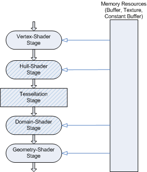
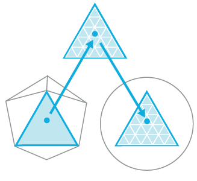

# Tessellator (TS) stage

The Tessellator (TS) stage creates a sampling pattern of the domain that represents the geometry patch and generates a set of smaller objects (triangles, points, or lines) that connect these samples.

## Purpose and uses

The following diagram highlights the stages of the Direct3D graphics pipeline.

The following diagram shows the progression through the tessellation stages.

The progression starts with the low-detail subdivision surface. The progression next highlights the input patch with the corresponding geometry patch, domain samples, and triangles that connect these samples. The progression finally highlights the vertices that correspond to these samples.

The Direct3D runtime supports three stages that implement tessellation, which converts low-detail subdivision surfaces into higher-detail primitives on the GPU. Tessellation tiles (or breaks up) high-order surfaces into suitable structures for rendering.

The tessellation stages work together to convert higher-order surfaces (which keep the model simple and efficient) to many triangles for detailed rendering within the Direct3D graphics pipeline.

Tessellation uses the GPU to calculate a more detailed surface from a surface constructed from quad patches, triangle patches or isolines. To approximate the high-ordered surface, each patch is subdivided into triangles, points, or lines using tessellation factors. The Direct3D graphics pipeline implements tessellation using three pipeline stages:

-   [Hull Shader (HS) stage](hull-shader-stage--hs-.md) - A programmable shader stage that produces a geometry patch (and patch constants) that correspond to each input patch (quad, triangle, or line).
-   Tessellator (TS) stage - A fixed-function pipeline stage that creates a sampling pattern of the domain that represents the geometry patch and generates a set of smaller objects (triangles, points, or lines) that connect these samples.
-   [Domain Shader (DS) stage](domain-shader-stage--ds-.md) - A programmable shader stage that calculates the vertex position that corresponds to each domain sample.

By implementing tessellation in hardware, a graphics pipeline can evaluate lower detail (lower polygon count) models and render in higher detail. While software tessellation can be done, tessellation implemented by hardware can generate an incredible amount of visual detail (including support for displacement mapping) without adding the visual detail to the model sizes and paralyzing refresh rates.

Benefits of tessellation:

-   Tessellation saves lots of memory and bandwidth, which allows an application to render higher detailed surfaces from low-resolution models. The tessellation technique implemented in the Direct3D graphics pipeline also supports displacement mapping, which can produce stunning amounts of surface detail.
-   Tessellation supports scalable-rendering techniques, such as continuous or view dependent levels-of-detail which can be calculated on the fly.
-   Tessellation improves performance by performing expensive computations at lower frequency (doing calculations on a lower-detail model). This could include blending calculations using blend shapes or morph targets for realistic animation or physics calculations for collision detection or soft body dynamics.

The Direct3D graphics pipeline implements tessellation in hardware, which off-loads the work from the CPU to the GPU. This can lead to very large performance improvements if an application implements large numbers of morph targets and/or more sophisticated skinning/deformation models.

The tessellator is a fixed-function stage initialized by binding a [hull shader](hull-shader-stage--hs-.md) to the pipeline. (see [How To: Initialize the Tessellator Stage](https://msdn.microsoft.com/library/windows/desktop/ff476341)). The purpose of the tessellator stage is to subdivide a domain (quad, tri, or line) into many smaller objects (triangles, points or lines). The tessellator tiles a canonical domain in a normalized (zero-to-one) coordinate system. For example, a quad domain is tessellated to a unit square.

### Phases in the Tessellator (TS) stage

The Tessellator (TS) stage operates in two phases:

-   The first phase processes the tessellation factors, fixing rounding problems, handling very small factors, reducing and combining factors, using 32-bit floating-point arithmetic.
-   The second phase generates point or topology lists based on the type of partitioning selected. This is the core task of the tessellator stage and uses 16-bit fractions with fixed-point arithmetic. Fixed-point arithmetic allows hardware acceleration while maintaining acceptable precision. For example, given a 64 meter wide patch, this precision can place points at a 2 mm resolution.

    | Type of Partitioning | Range                       |
    |----------------------|-----------------------------|
    | Fractional\_odd      | \[1...63\]                  |
    | Fractional\_even     | TessFactor range: \[2..64\] |
    | Integer              | TessFactor range: \[1..64\] |
    | Pow2                 | TessFactor range: \[1..64\] |

     

Tessellation is implemented with two programmable shader stages: a [hull shader](hull-shader-stage--hs-.md) and a [domain shader](domain-shader-stage--ds-.md). These shader stages are programmed with HLSL code that is defined in shader model 5. The shader targets are: hs\_5\_0 and ds\_5\_0. The title creates the shader, then code for the hardware is extracted from compiled shaders passed into the runtime when shaders are bound to the pipeline.

### Enabling/disabling tessellation

Enable tessellation by creating a hull shader and binding it to the hull-shader stage (this automatically sets up the tessellator stage). To generate the final vertex positions from the tessellated patches, you will also need to create a [domain shader](domain-shader-stage--ds-.md) and bind it to the domain-shader stage. Once tessellation is enabled, the data input to the Input Assembler (IA) stage must be patch data. The input assembler topology must be a patch constant topology.

To disable tessellation, set the hull shader and the domain shader to **NULL**. Neither the [Geometry Shader (GS) stage](geometry-shader-stage--gs-.md) nor the [Stream Output (SO) stage](stream-output-stage--so-.md) can read hull-shader output-control points or patch data.

## Input

The tessellator operates once per patch using the tessellation factors (which specify how finely the domain will be tessellated) and the type of partitioning (which specifies the algorithm used to slice up a patch) that are passed in from the hull-shader stage.

## Output

The tessellator outputs uv (and optionally w) coordinates and the surface topology to the domain-shader stage.

## Related topics

[Graphics pipeline](graphics-pipeline.md)

 

 

