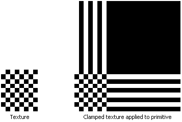

# Texture addressing modes

Your Direct3D application can assign texture coordinates to any vertex of any primitive. Typically, the u- and v-texture coordinates that you assign to a vertex are in the range of 0.0 to 1.0 inclusive. However, by assigning texture coordinates outside that range, you can create certain special texturing effects. .

You control what Direct3D does with texture coordinates that are outside the \[0.0, 1.0\] range by setting the texture addressing mode. For instance, you can have your application set the texture addressing mode so that a texture is tiled across a primitive.

Direct3D enables applications to perform texture wrapping. See [Texture wrapping](texture-wrapping.md).

Enabling texture wrapping effectively makes texture coordinates outside the \[0.0, 1.0\] range invalid, and the behavior for rasterizing such delinquent texture coordinates is undefined in this case. When texture wrapping is enabled, texture addressing modes are not used. Take care that your application does not specify texture coordinates lower than 0.0 or higher than 1.0 when texture wrapping is enabled.

## Summary of the texture addressing modes

| Texture addressing mode | Description                                                                                                                           |
|-------------------------|---------------------------------------------------------------------------------------------------------------------------------------|
| Wrap                    | Repeats the texture on every integer junction.                                                                                        |
| Mirror                  | Mirrors the texture at every integer boundary.                                                                                        |
| Clamp                   | Clamps your texture coordinates to the \[0.0, 1.0\] range; Clamp mode applies the texture once, then smears the color of edge pixels. |
| Border Color            | Uses an arbitrary *border color* for any texture coordinates outside the range of 0.0 through 1.0, inclusive.                         |

 

## Wrap texture address mode

The Wrap texture address mode makes Direct3D repeat the texture on every integer junction.

Suppose, for example, your application creates a square primitive and specifies texture coordinates of (0.0,0.0), (0.0,3.0), (3.0,3.0), and (3.0,0.0). Setting the texture addressing mode to "Wrap" results in the texture being applied three times in both the u-and v-directions, as shown in the following illustration.

Contrast this with the following **Mirror texture address mode**.

## Mirror texture address mode

The Mirror texture address mode causes Direct3D to mirror the texture at every integer boundary.

Suppose, for example, your application creates a square primitive and specifies texture coordinates of (0.0,0.0), (0.0,3.0), (3.0,3.0), and (3.0,0.0). Setting the texture addressing mode to "Mirror" results in the texture being applied three times in both the u- and v-directions. Every other row and column that it is applied to is a mirror image of the preceding row or column, as shown in the following illustration.

Contrast this with the previous **Wrap texture address mode**.

## Clamp texture address mode

The Clamp texture address mode causes Direct3D to clamp your texture coordinates to the \[0.0, 1.0\] range; Clamp mode applies the texture once, then smears the color of edge pixels.

Suppose that your application creates a square primitive and assigns texture coordinates of (0.0,0.0), (0.0,3.0), (3.0,3.0), and (3.0,0.0) to the primitive's vertices. Setting the texture addressing mode to "Clamp" results in the texture being applied once. The pixel colors at the top of the columns and the end of the rows are extended to the top and right of the primitive respectively.

The following illustration shows a clamped texture.

## Border Color texture address mode

The Border Color texture address mode causes Direct3D to use an arbitrary color, known as the *border color*, for any texture coordinates outside the range of 0.0 through 1.0, inclusive.

In the following illustration, the application specifies that the texture be applied to the primitive using a red border.

## Device limitations

Although the system generally allows texture coordinates outside the range of 0.0 and 1.0, inclusive, hardware limitations often affect how far outside that range texture coordinates can be. A rendering device communicates the limit for the full range of texture coordinates allowed by the device, when you retrieve the device's capabilities.

For instance, if this value is 128, then the input texture coordinates must be kept in the range -128.0 to +128.0. Passing vertices with texture coordinates outside this range is invalid. The same restriction applies to the texture coordinates generated as a result of automatic texture coordinate generation and texture coordinate transformations.

Texture repeating limitations can depend on the size of the texture indexed by the texture coordinates. In that case, supposing the texture dimension is 32, and the range of texture coordinates allowed by the device is 512, the actual valid texture coordinate range would therefore be 512/32 = 16, so the texture coordinates for this device must be within the range of -16.0 to +16.0.

## Related topics

[Textures](textures.md)

 

 

