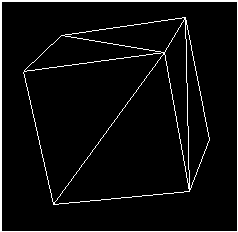
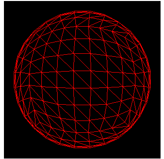

# Triangle strips


A triangle strip is a series of connected triangles. Because the triangles are connected, the application does not need to repeatedly specify all three vertices for each triangle. For example, you need only seven vertices to define the following triangle strip.

## <span id="Example"></span><span id="example"></span><span id="EXAMPLE"></span>Example


The system uses vertices v1, v2, and v3 to draw the first triangle; v2, v4, and v3 to draw the second triangle; v3, v4, and v5 to draw the third; v4, v6, and v5 to draw the fourth; and so on. Notice that the vertices of the second and fourth triangles are out of order; this is required to make sure that all the triangles are drawn in a clockwise orientation.

Most objects in 3D scenes are composed of triangle strips. This is because triangle strips can be used to specify complex objects in a way that makes efficient use of memory and processing time.

The following illustration depicts a rendered triangle strip.


The following code shows how to create vertices for this triangle strip.

```
struct CUSTOMVERTEX
{
float x,y,z;
};

CUSTOMVERTEX Vertices[] = 
{
    {-5.0, -5.0, 0.0},
    { 0.0,  5.0, 0.0},
    { 5.0, -5.0, 0.0},
    {10.0,  5.0, 0.0},
    {15.0, -5.0, 0.0},
    {20.0,  5.0, 0.0}
};
```

The code example below shows how to render this triangle strip in Direct3D.

```
//
// It is assumed that d3dDevice is a valid
// pointer to a device interface.
//
d3dDevice->DrawPrimitive( D3DPT_TRIANGLESTRIP, 0, 4);
```

## <span id="Polygons"></span><span id="polygons"></span><span id="POLYGONS"></span>Polygons


Often, triangle strips are used to build polygons. A polygon is a closed 3D figure delineated by at least three vertices. The simplest polygon is a triangle. Microsoft Direct3D uses triangles to compose most of its polygons because all three vertices in a triangle are guaranteed to be coplanar. Rendering nonplanar vertices is inefficient. You can combine triangles to form large, complex polygons and meshes.

The following illustration shows a cube. Two triangles form each face of the cube. The entire set of triangles forms one cubic primitive. You can apply textures to the surfaces of primitives to make them appear to be a single solid form. For details, see [Textures](textures.md).



You can also use triangles to create primitives whose surfaces appear to be smooth curves. The following illustration shows how a sphere can be simulated with triangles. After a material is applied, the sphere can be made to look curved when it is rendered.



## <span id="related-topics"></span>Related topics


[Primitives](primitives.md)

 

 


