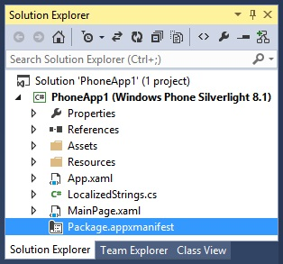
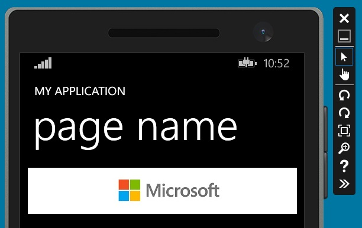

# AdControl in Windows Phone Silverlight

This walkthrough shows how to use the [AdControl](https://msdn.microsoft.com/library/windows/apps/hh524191.aspx) class to display banner ads in a Silverlight app for Windows Phone 8.1 or Windows Phone 8.0.

> **Note for Windows Phone Silverlight 8.0**&nbsp;&nbsp;Banner ads are still supported for existing Windows Phone 8.0 Silverlight apps that use an **AdControl** from an earlier release of the Universal Ad Client SDK or Microsoft Advertising SDK and that are already available in the Store. However, banner ads are no longer supported in new Windows Phone 8.0 Silverlight projects. In addition, some debugging and testing scenarios are limited in Windows Phone 8.x Silverlight projects. For more information, see [Display ads in your app](display-ads-in-your-app.md#silverlight_support).

## Add the advertising assemblies to your project

To get started, download and install the NuGet package that contains the Microsoft advertising assemblies for Windows Phone Silverlight to your project.

1.  Open your project in Visual Studio.

2.  Click **Tools**, point to **NuGet Package Manager**, and click **Package Manager Console**.

3.  In the **Package Manager Console** window, enter one of these commands.

  * If your project targets Windows Phone 8.0, enter this command.

      ```syntax
      Install-Package Microsoft.Advertising.WindowsPhone.SL80 -Version 6.2.40501.1
      ```

  * If your project targets Windows Phone 8.1, enter this command.

      ```syntax
      Install-Package Microsoft.Advertising.WindowsPhone.SL81 -Version 8.1.50112
      ```

    After entering the command, all the necessary Microsoft advertising assemblies for Silverlight are downloaded to your local project via NuGet packages, and references to these assemblies are automatically added to your project.

## Code your app


1.  Add the following capabilities to the in the **Capabilities** node in your WMAppManifest.xml file.

  ``` syntax
  <Capability Name="ID_CAP_IDENTITY_USER"/>
  <Capability Name="ID_CAP_MEDIALIB_PHOTO"/>
  <Capability Name="ID_CAP_PHONEDIALER"/>
  ```

  For this example, your **Capabilities** node looks like:

  ``` syntax
  <Capabilities>
      <Capability Name="ID_CAP_NETWORKING"/>
      <Capability Name="ID_CAP_MEDIALIB_AUDIO"/>
      <Capability Name="ID_CAP_MEDIALIB_PLAYBACK"/>
      <Capability Name="ID_CAP_SENSORS"/>
      <Capability Name="ID_CAP_WEBBROWSERCOMPONENT"/>
      <Capability Name="ID_CAP_IDENTITY_USER"/>
      <Capability Name="ID_CAP_MEDIALIB_PHOTO"/>
      <Capability Name="ID_CAP_PHONEDIALER"/>
  </Capabilities>
  ```

2.  (Optional) Save your project. Click on the **Save All** icon or under the **File** menu click **Save All**.

3.  Add the **Internet (Client & Server)** capability to the Package.appxmanifest file in your project. In **Solution Explorer**, double click **Package.appxmanifest**.

    

    In the **Editor**, click the **Capabilities** tab. Check the **Internet (Client & Server)** box.

4.  (Optional) Save your project. Click on the **Save All** icon or under the **File** menu click **Save All**.

5.  Modify the Silverlight markup in the MainPage.xaml file to include the **Microsoft.Advertising.Mobile.UI** namespace.

  ``` xml
  xmlns:UI="clr-namespace:Microsoft.Advertising.Mobile.UI;assembly=Microsoft.Advertising.Mobile.UI"
  ```

  The header of your page will have the following code:

  ``` xml
  xmlns:mc="http://schemas.openxmlformats.org/markup-compatibility/2006"
  xmlns:UI="clr-namespace:Microsoft.Advertising.Mobile.UI;assembly=Microsoft.Advertising.Mobile.UI"
  x:Class="PhoneApp1.MainPage"
  ```

6.  In the **Grid** tag, add the following code for the **AdControl**. Assign the **ApplicationId** and **AdUnitId** properties to the test values provided in [Test mode values](test-mode-values.md), and adjust the **Height** and **Width** properties to one of the [supported ad sizes for banner ads](supported-ad-sizes-for-banner-ads.md).

  > **Note**&nbsp;&nbsp;You will replace the test **ApplicationId** and **AdUnitId** values with live values before submitting your app for submission.

  ``` xml
  <Grid x:Name="ContentPanel" Grid.Row="1">
      <UI:AdControl
          ApplicationId="3f83fe91-d6be-434d-a0ae-7351c5a997f1"
          AdUnitId="10865270"
          HorizontalAlignment="Left"
          Height="80"
          VerticalAlignment="Top"
          Width="480"/>
  </Grid>
  ```

7.  Build and run your project. Confirm that your app displays an ad, similar to the following:

  

## Release your app with live ads using Dev Center

1.  In the Dev Center dashboard, go to the **Monetization** &gt; **Monetize with ads** page for your app, and [create a standalone ad unit](../publish/monetize-with-ads.md). For the ad unit type, specify **Banner**. Make note of both the ad unit ID and the application ID.

2.  In your code, replace the test ad unit values (**applicationId** and **adUnitId**) with the live values you generated in Dev Center.

3.  [Submit your app](../publish/app-submissions.md) to the Store using the Dev Center dashboard.

4.  Review your [advertising performance reports](../publish/advertising-performance-report.md) in the Dev Center dashboard.


 
