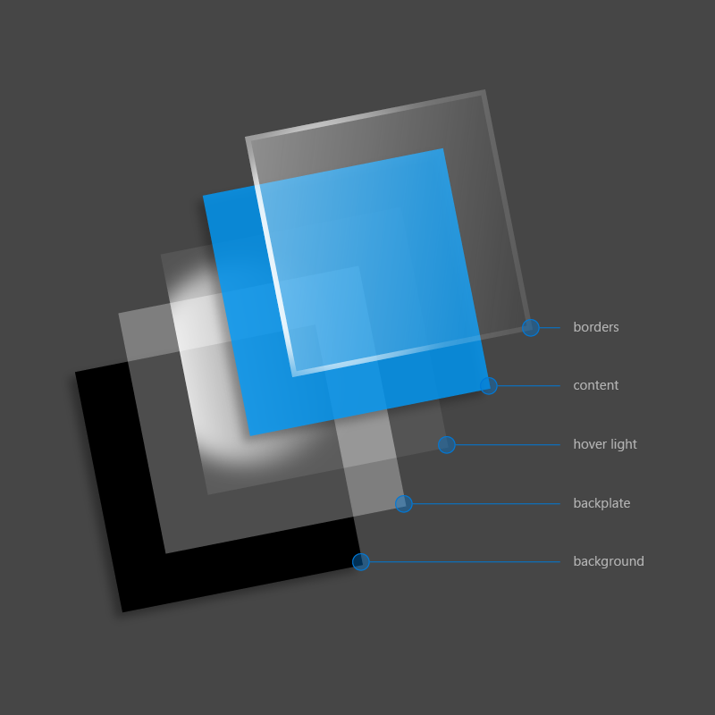

# Reveal

> [!IMPORTANT]
> This article describes functionality that hasn’t been released yet and may be substantially modified before it's commercially released. Microsoft makes no warranties, express or implied, with respect to the information provided here.

Reveal is a lighting effect that helps bring depth and focus to your app's interactive elements.

> **Important APIs**: [RevealBrush class](https://docs.microsoft.com/uwp/api/windows.ui.xaml.media.revealbrush), [RevealBackgroundBrush class](https://docs.microsoft.com/uwp/api/windows.ui.xaml.media.revealbackgroundbrush), [RevealBorderBrush class](https://docs.microsoft.com/uwp/api/windows.ui.xaml.media.revealborderbrush), [RevealBrushHelper class](https://docs.microsoft.com/uwp/api/windows.ui.xaml.media.revealbrushhelper), [VisualState class](https://docs.microsoft.com/en-us/uwp/api/Windows.UI.Xaml.VisualState)

The Reveal behavior does this by revealing pieces of elements around hero (or focal) content when the mouse or focus rectangle is over the desired areas.


Through exposing the hidden borders around objects, Reveal gives users a better understanding of the space that they are interacting with, and helps them understand the actions available. This is especially important in list controls and controls with backplates.

## What is reveal?

There are two main visual components to Reveal: the **Hover Reveal** behavior, and the **Border Reveal** behavior.



The Hover Reveal is tied directly to the content being hovered over (via pointer or focus input), and applies a gentle halo shape around the hovered or focused item, letting you know you can interact with it.

The Border Reveal is applied to the focused item and items nearby. This shows you that those nearby objects can take actions similar to the one currently focused.

The Reveal recipe breakdown is:

- Border Reveal will be on top of all content but on the designated edges
- Text and content will be displayed directly under Border Reveal
- Hover Reveal will be beneath content and text
- The backplate (that turns on and enables Hover Reveal)
- The background (background of control)

<!--
<div class=”microsoft-internal-note”>
To create your own Reveal lighting effect for static comps or prototype purposes, see the full [uni design guidance](http://uni/DesignDepot.FrontEnd/#/ProductNav/3020/1/dv/?t=Resources%7CToolkit%7CReveal&f=Neon) for this effect in illustrator.
</div>
-->

## How to use it

Reveal exposes geometry around your cursor when you need it, and seamlessly fades it out once you’ve moved on.

Reveal is best used when enabled on the main content of your app (hero content) that has implied boundries and backplates to them. Reveal should additionally be used on collection or list-like controls.

## Controls that automatically use Reveal

- [**ListView**](../controls-and-patterns/lists.md)
- [**TreeView**](../controls-and-patterns/tree-view.md)
- [**NavigationView**](../controls-and-patterns/navigationview.md)
- [**AutosuggestBox**](../controls-and-patterns/auto-suggest-box.md)

## Enabling Reveal on other common controls

If you have a scenario where Reveal should be applied (these controls are main content and/or are used in a list or collection orientation), we've provided opt-in resourse styles that allow you to enable Reveal for those types of situations.

These controls do not have Reveal by default as they are smaller controls that are usually helper controls to the main focal points of your application; but every app is different, and if these controls are used the most in your app, we've provided some styles to aid with that:

| Control Name   | Resource Name |
|----------|:-------------:|
| Button |  ButtonRevealStyle |
| ToggleButton | ToggleButtonRevealStyle |
| RepeatButton | RepeatButtonRevealStyle |
| AppBarButton | AppBarButtonRevealStyle |
| SemanticZoom | SemanticZoomRevealStyle |
| ComboBoxItem | ComboxBoxItemRevealStyle |

To apply these styles, simply update the Style property like so:

```XAML
<Button Content="Button Content" Style="{StaticResource ButtonRevealStyle}"/>
```

> [!NOTE]
> The 16190 version of the SDK does not make these styles automatically available. To get them, you need to manually copy them from generic.xaml into your app. Generic.xaml is typically located at C:\Program Files (x86)\Windows Kits\10\DesignTime\CommonConfiguration\Neutral\UAP\10.0.16190.0\Generic. This issue will be fixed in a later build. 

## Enabling Reveal on custom controls

To enable Reveal on custom controls or re-templated controls, you can go into the style for that control in the Visual States of that control's template, specify Reveal on the root grid:

```xaml
<VisualState x:Name="PointerOver">
  <VisualState.Setters>
    <Setter Target="RootGrid.(RevealBrushHelper.State)" Value="PointerOver" />
    <Setter Target="RootGrid.Background" Value="{ThemeResource ButtonRevealBackgroundPointerOver}"/>
    <Setter Target="ContentPresenter.BorderBrush" Value="{ThemeResource ButtonRevealBorderBrushPointerOver}"/>
    <Setter Target="ContentPresenter.Foreground" Value="{ThemeResource ButtonForegroundPointerOver}"/>
  </VisualState.Setters>
</VisualState>
```

To get the pull effect of Reveal you'll need to add the same RevealBrushHelper to the PressedState as well:

```xaml
<VisualState x:Name="Pressed">
  <VisualState.Setters>
    <Setter Target="RootGrid.(RevealBrushHelper.State)" Value="Pressed" />
    <Setter Target="RootGrid.Background" Value="{ThemeResource ButtonRevealBackgroundPressed}"/>
    <Setter Target="ContentPresenter.BorderBrush" Value="{ThemeResource ButtonRevealBorderBrushPressed}"/>
    <Setter Target="ContentPresenter.Foreground" Value="{ThemeResource ButtonForegroundPressed}"/>
  </VisualState.Setters>
</VisualState>
```


Using our system resource Reveal means we will handle all the theme changes for you.

## Do's and don'ts
- Do have Reveal on elements that the user can take actions on - Reveal should not be on static content
- Do show Reveal in lists or collections of data
- Do apply Reveal to clearly contained content with backplates
- Don’t show Reveal on static backgrounds, text, or images that you can’t interact with
- Don’t apply Reveal to unrelated floating content
- Don’t use Reveal in one-off, isolated situations, like content dialogs or notifications
- Don’t use Reveal in security decisions, as it may draw attention away from the message you need to
  deliver to your user

## Related articles

- [RevealBrush class](https://docs.microsoft.com/uwp/api/windows.ui.xaml.media.revealbrush)
- [**Acrylic**](acrylic.md)
- [**Composition Effects**](https://msdn.microsoft.com/windows/uwp/graphics/composition-effects)
