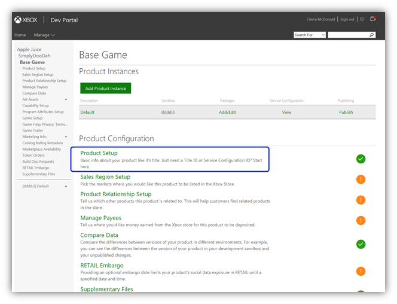
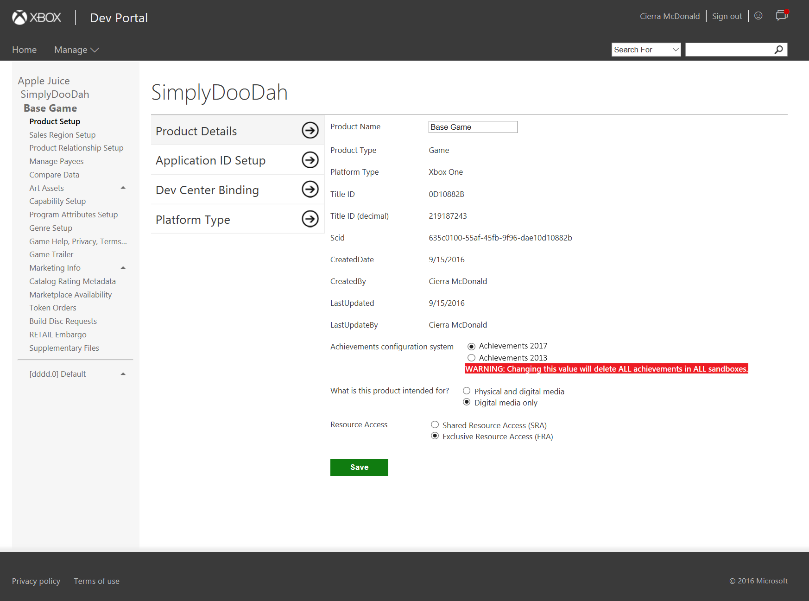
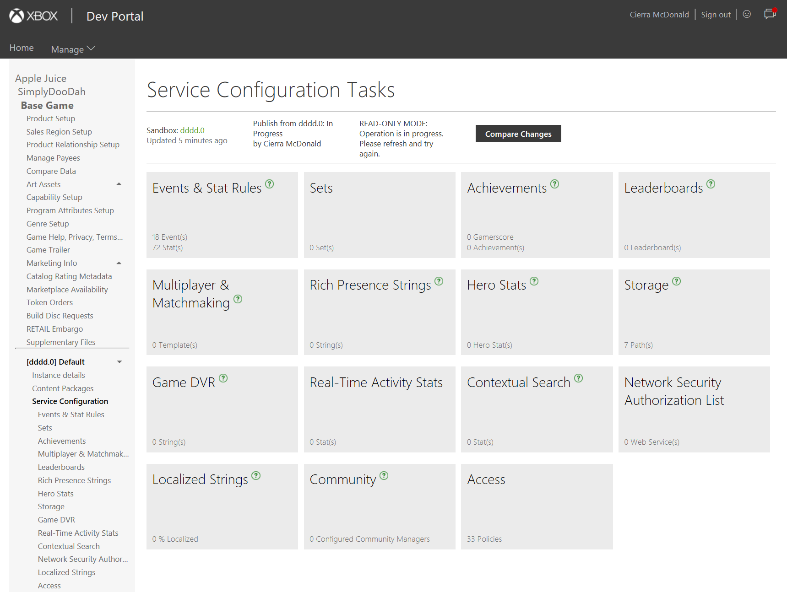
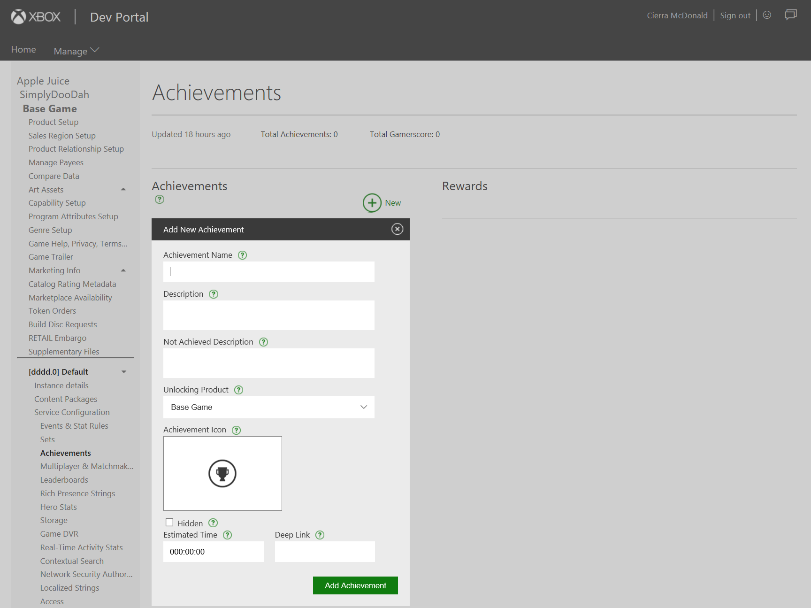
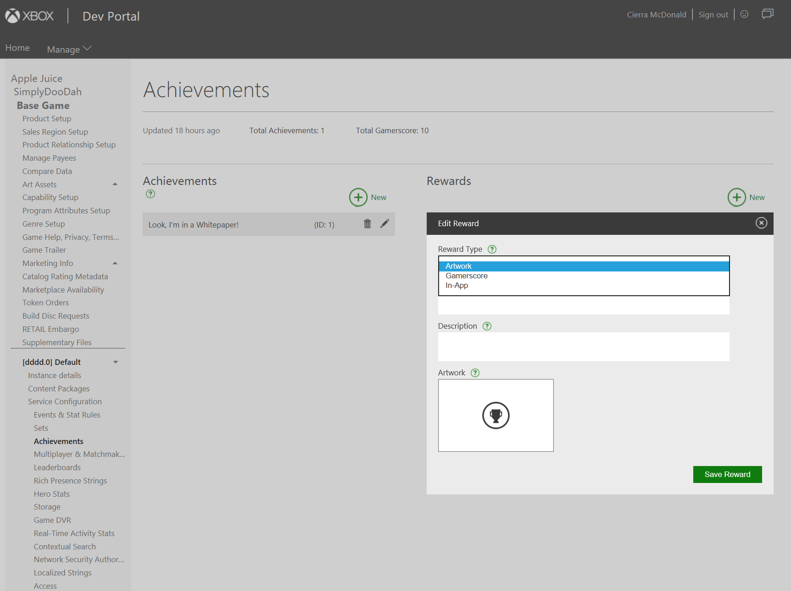
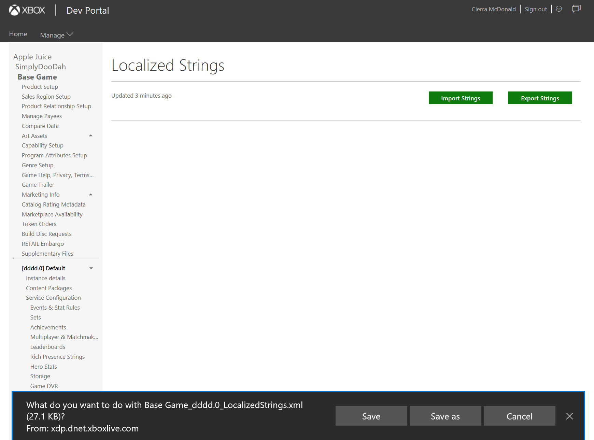
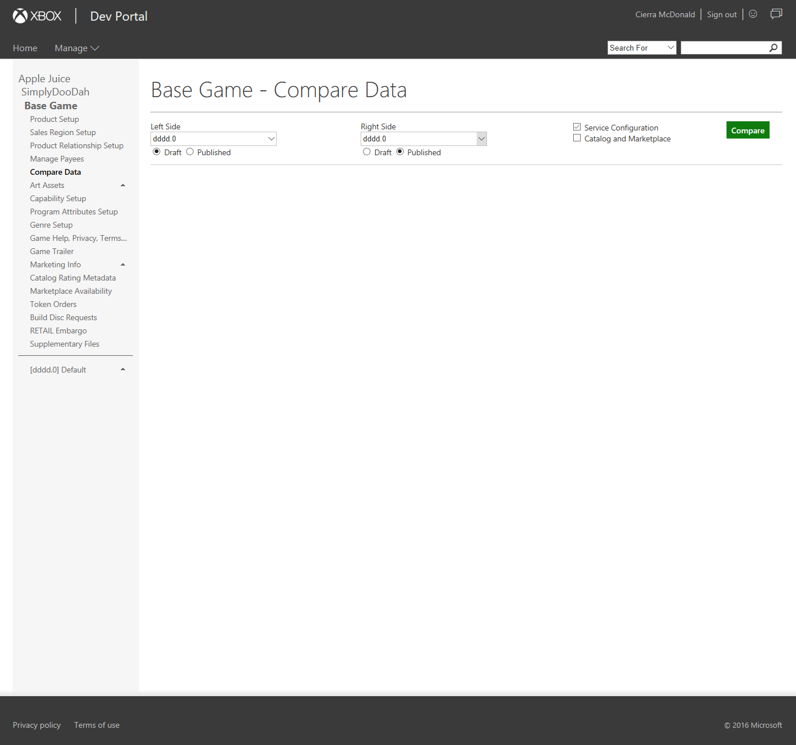
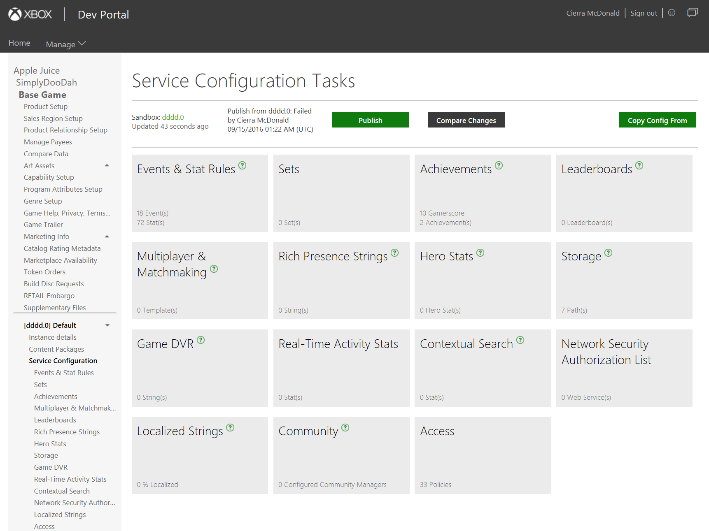
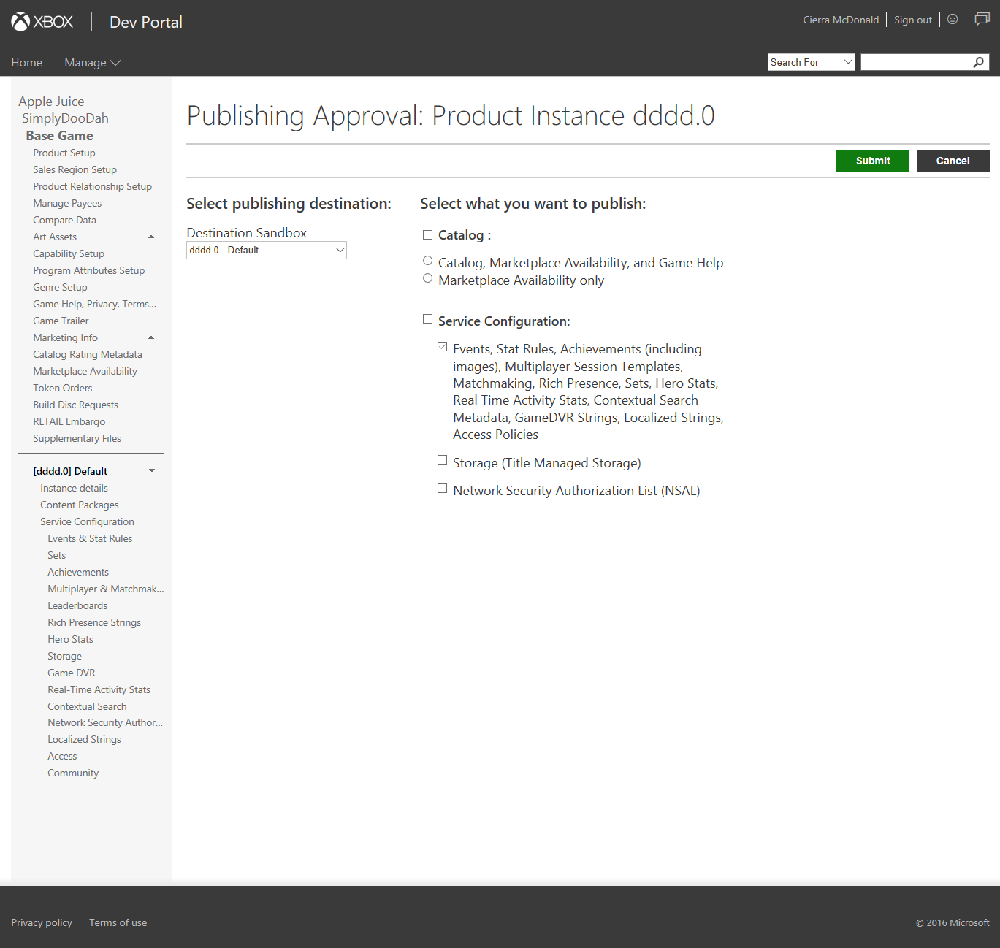

# Simplified Achievements

The Simplified Achievements system enables game developers to use a direct calling model to unlock achievements for new Xbox Live games on Xbox One, Windows 10, Windows 10 Phone, Android, and iOS.

## Introduction

With Xbox One, we introduced a new Cloud-Powered Achievements system that empowers game developers to drive the data for their Xbox Live capabilities, such as user stats, achievements, rich presence, and multiplayer, by simply sending in-game telemetry events. This has opened up a multitude of new benefits – a single event can update data for multiple Xbox Live features; Xbox Live configuration lives on the server instead of in the client; and much more.

In the years following the Xbox One launch, we have listened closely to game developer feedback, and developers have consistently shared the following:

1.  **Desire to unlock achievements via a direct calling pattern.** Many developers build games for various platforms, including previous versions of Xbox, and the achievement-like systems on those platforms use a direct calling method. Supporting direct unlock calls on Xbox One and other current-gen Xbox platforms would ease their cross-platform game development needs and development time costs.

2.  **Minimize configuration complexity.** With the Cloud-Powered Achievements system, an achievement’s unlock logic must be configured in Xbox Live so that the services know how to interpret the title’s stats data and when to unlock the achievement for a user. This was done via a new Achievement Rules section of an achievement’s configuration that did not previously exist. While having unlock logic in the cloud can be quite powerful, this additional configuration requirement adds complexity into the design & creation of a title’s achievements.

3.  **Difficult to troubleshoot.** While the Cloud-Powered Achievements system introduces a variety of helpful capabilities, it can also be more difficult for game developers to validate and troubleshoot issues with their achievements since achievement unlocks are triggered indirectly by rules that live on the service rather than directly controlled by the game itself.

It is worth noting that game developers have also repeatedly shared feedback that they appreciate and value certain features that were introduced along with the Cloud-Powered Achievements system:

1.  New user experience features such as achievement progression, real-time updates, concept art rewards, and posting unlocks into activity feed.

2.  Configuration improvements such as a service config instead of a local config that must be included in the game package (i.e. gameconfig, XLAST, SPA, etc.) and the ability to easily edit achievement strings & images after the game has shipped.

With Simplified Achievements, we are building a replacement of the existing Cloud-Powered Achievements system for future titles to use that makes it even easier for Xbox game developers to configure achievements, integrate achievement unlocks & updates into the game code, and validate that the achievements are working as expected.

## What’s Different with Simplified Achievements

|                          | Simplified Achievements system        | Cloud-Powered Achievements system      |
|--------------------------|---------------------------------------|----------------------------------------|
| Unlock Trigger           | Directly via API call                 | Indirectly via telemetry events        |
| Unlock Owner             | Title                                 | Xbox Live                              |
| Configuration            | Strings, images, rewards              | Strings, images, rewards, unlock rules  \[+ stats, +events\]                    |
| Progression              | Supported <br>*directly via API call*                | Supported <br> *indirectly via telemetry events*       |
| Real-Time Activity (RTA) | Supported                             | Supported                              |
| Challenges               | Not Supported   | Supported                      |
| Testing APIs             | Supported                             | Not Supported                          |

## Title Requirements

The following are the requirements of any title that will use the Simplified Achievements system.

1.  **Must be a new (unreleased) title.** Titles that have already been released and are using the Cloud-Powered Achievements system are ineligible. For more, see [Why can’t existing titles “migrate” onto the new Simplified Achievements system?](#_Why_can’t_existing)

2.  **Must use August 2016 XDK or newer.** The Simplified Achievements API was released in the August 2016 XDK.

3.  **Must be an XDK or UWP title.** The Simplified Achievements system is not available for legacy platforms, including Xbox 360, Windows 8.x or older, nor Windows Phone 8 or older.

## Configuring Achievements in XDP

In the Simplified Achievements system, the only configuration needs for an achievement are its name, locked & unlocked descriptions, display image, and reward information. (Note: Valid achievement rewards still include: Gamerscore, art rewards, and in-game rewards.)

<span id="_Enable_Simplified_Achievements" class="anchor"></span>

### Enable Simplified Achievements

The Achievements system used by your title is managed at the product level.  

Developers may switch their products between Simplified and Cloud-Powered Achievements systems at any time prior to publishing into RETAIL. Upon switching Achievements systems, in either direction, all of your title’s configured & published achievements (and challenges, if applicable) will be deleted from every sandbox. 

Once a title’s service configuration has been published to RETAIL, its Achievements system is permanently set and cannot be changed. **No exceptions can be made. This is required for both technical & policy reasons.**

1.  From your product page in XDP, navigate to **Product Setup**.


2.  Select **Product Details**.


1.  Switch the **Achievements configuration system** toggle to *Achievements 2017.*


1.  You will receive a warning that all of your title’s achievements will be deleted in all sandboxes. If you are OK with the deletion of your existing achievements in all sandboxes, click **Save**.


### Configure an Achievement

1.  Enable Simplified Achievements for your title.

2.  Navigate to **Service Configuration** and select **Achievements**.


1.  Enter the achievement display details.

    *Note: These strings are used for display in the XDP UI. The final strings that will be shown to users must be configured in the “Localized Strings” service configuration option (step 5).*<br>


1.  To add Gamerscore, Artwork, or In-App reward onto the achievement, click **New** under the **Rewards** section.


1.  If supplying localized strings for your achievement names & descriptions, navigate to **Localized Strings.**

    *Note: Don’t forget to define your English localized strings. Otherwise, your users in non-USA countries who prefer English text may not get the expected result.*<br>


1.  To compare your recent changes to the currently published service configuration data, navigate to **Compare Data** and select the desired sandboxes for comparison.


1.  When ready to publish & test in your dev sandbox, return to **Service Configuration** and click the **Publish** button.


1.  Choose the destination sandbox where you want to test (likely the same sandbox where you drafted the achievements).

    Select the *Events, Stat Rules, Achievements…* checkbox under Service Configuration.

    Click **Submit.**



## Configuration via Universal Developer Center (UDC)

*Coming soon!*

## UpdateAchievement API

Once your achievements are configured & published to your dev sandbox, your title can unlock them in the dev sandbox by calling the UpdateAchievement API.

The API is available in both the XDK and the Xbox Live SDK.

### API Signature

The API signature is as follows:

```c++
/// <summary>
    /// Allow achievement progress to be updated and achievements to be unlocked.  
    /// This API will work even when offline. On PC and Xbox One, updates will be posted by the system when connection is re-established even if the title isn't running
    /// </summary>
    /// <param name="xboxUserId">The Xbox User ID of the player.</param>
    /// <param name="titleId">The title ID.</param>
    /// <param name="serviceConfigurationId">The service configuration ID (SCID) for the title.</param>
    /// <param name="achievementId">The achievement ID as defined by XDP or Dev Center.</param>
    /// <param name="percentComplete">The completion percentage of the achievement to indicate progress.
    /// Valid values are from 1 to 100. Set to 100 to unlock the achievement.  
    /// Progress will be set by the server to the highest value sent</param>
    /// <remarks>
    /// Returns a task<T> object that represents the state of the asynchronous operation.
    ///
    /// This method calls V2 GET /users/xuid({xuid})/achievements/{scid}/update
    /// </remarks>
    _XSAPIIMP pplx::task<xbox::services::xbox_live_result<void>> update_achievement(
        _In_ const string_t& xboxUserId,
        _In_ uint32_t titleId,
        _In_ const string_t& serviceConfigurationId,
        _In_ const string_t& achievementId,
        _In_ uint32_t percentComplete
        );
```

`xbox::services::xbox_live_result<T>` is the return call for all C++ Xbox Live Services API calls.

For more information, check out the Xfest 2015 talk, “XSAPI: C++, No Exceptions!”<br>
[video](http://go.microsoft.com/?linkid=9888207) |  [slides](https://developer.xboxlive.com/en-us/platform/documentlibrary/events/Documents/Xfest_2015/Xbox_Live_Track/XSAPI_Cpp_No_Exceptions.pptx)

### Unlocking via UpdateAchievement API

To unlock an achievement, set the *percentComplete* to 100.

If the user is online, the request will be immediately sent to the Xbox Live Achievements service and will trigger the following user experiences:

-   The user will receive an Achievement Unlocked notification;

-   The specified achievement will appear as Unlocked in the user’s achievement list for the title;

-   The unlocked achievement will be added to the user’s activity feed.

> *Note: There will be no visible difference in user experiences for achievements that use the Simplified Achievements system and the Cloud-Powered Achievements.*

If the user is offline, the unlock request will be queued locally on the user’s device. When the user’s device has reestablished network connectivity, the request will automatically be sent to the Achievements service – note: no action is required from the game to trigger this – and the above user experiences will occur as described.

### Updating Completion Progress via UpdateAchievement API

To update a user’s progress toward unlocking an achievement, set the *percentComplete* to the appropriate whole number between 1-100.

An achievement’s progress can only increase. If *percentComplete* is set to a number less than the achievement’s last *percentComplete* value, the update will be ignored. For example, if the achievement’s *percentComplete* had previously been set to 75, sending an update with a value of 25 will be ignored and the achievement will still be displayed as 75% complete.

If *percentComplete* is set to 100, the achievement will unlock.

If *percentComplete* is set to a number greater than 100, the API will behave as if you set it to exactly 100.

## Testing Achievements

There are two big asks that we typically hear from developers when it comes to validating their achievements during development:

1.  I want to reset achievements for a test user.

2.  I want to add unlocked achievements (and Gamerscore) for a test user.

With the Simplified Achievements system, we are building APIs that will support both of these scenarios and will allow game developers to more easily test their title’s achievements within their dev sandboxes.

*More info coming soon!*

## Frequently Asked Questions

### <span id="_Why_are_Challenges" class="anchor"></span>Can I ship my title using the Simplified Achievements system before the Mandatory date?

Absolutely! Beginning on the First Approved date, all new titles are welcomed and encouraged to make use of the Simplified Achievements system in lieu of the Cloud-Powered Achievements system.

### Why are Challenges not supported in the Simplified Achievements system?

Usage data across Xbox games has shown that the current implementation and presentation of challenges does not fulfill a need for most game developers. We will continue gathering developer input and feedback in this space and endeavor to deliver future features that are more on point with developer needs. The newly released Xbox Arena is an example of a feature that introduces new competitive capabilities for Xbox games a new, but similar, direction.

### Can I still add new achievements every calendar quarter if my title is using the Simplified Achievements system?

Yes. The Achievements policy is unchanged.

### <span id="_Why_can’t_existing" class="anchor"></span>Why can’t existing titles “migrate” onto the new Simplified Achievements system?

For the vast majority of existing titles, a ‘migration’ to the Simplified Achievements system would not be limited to simply updating their service configurations and swapping out event writes for achievement unlock calls – although these changes alone would be very costly and would carry significant risk of error and unintended behavior that could result in the achievements being irreparably broken. Rather, most existing titles also have users with existing data. Attempting to convert a live game that is already using the Cloud-Powered Achievements system would not only be a very costly effort, for both the developer and Xbox, but would significantly jeopardize existing users’ profiles and/or game experiences.

### If my title was released using the Cloud-Powered Achievements system, can any future DLC for the title switch to Simplified Achievements?

All achievements for a title must use the same Achievements system. Whichever Achievements system is used by the base game’s achievements is the system that must be used for all future achievements for the title.

### While testing achievements in my dev sandbox, can I mix-and-match between using the Simplified Achievements system and the Cloud-Powered Achievements system?

No. All achievements for a title must use the same Achievements system.

### If I want to try out each Achievements system after the First Approved date, can I use different Achievements systems between different dev sandboxes?

The Achievements system used by your title is set at the product level. If your title’s service configuration has not been published to RETAIL, you can try out each Achievements system in your dev sandboxes. For more information, see [Enable Simplified Achievements (XDP)](#_Enable_Simplified_Achievements). Note that changing your Achievements system will cause the deletion of all of your title’s configured & published achievements in all sandboxes.

### Does Simplified Achievements also include offline unlocks?

If the title unlocks an achievement whiel the device is offline, the UpdateAchievement API will automatically queue the offline unlock requests and will auto-sync to Xbox Live when the device has reestablished network connectivity, similar to the current Cloud-Powered Achievements system’s offline experience. Achievements unlocks will not occur while the user is offline.

### I see a new “AchievementUpdate” event in XDP. If my title uses that event, does that mean it has simplified achievements?

The *AchievementUpdate* base event is required by Xbox Live for backend purposes. You can safely ignore it. If your title configures an event using this base event type, those event writes will be ignored by Xbox Live. Titles that are built on the Cloud-Powered Achievements system should continue to configure their events by using the other base event types. Titles that are built on the Simplified Achievements system need not configure *any* events for achievement purposes.

### How do I disable Simplified Achievements for my title?

If your title is set to use the Simplified Achievements system and you wish to use the Cloud-Powered Achievements system instead, follow the [Enable Simplified Achievements (XDP)](#_Enable_Simplified_Achievements) instructions *except* set the **Achievements configuration system** toggle to *Achievements 2013.*

If your title is created after the Mandatory date, you cannot disable the Simplified Achievements system for your title.
