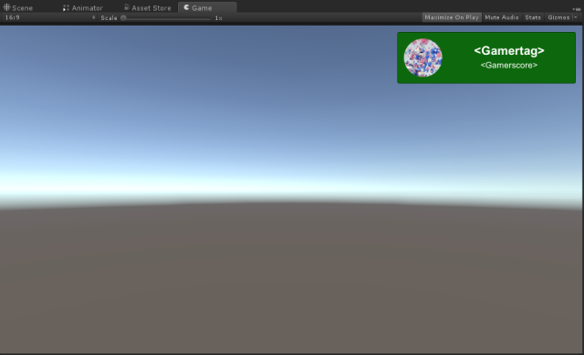
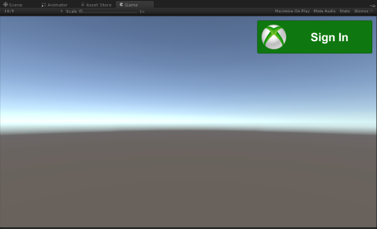
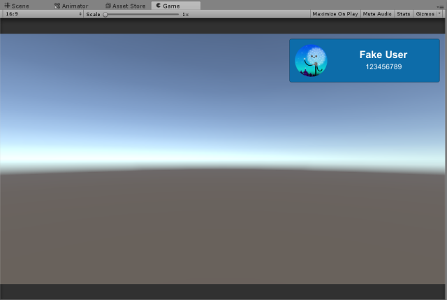

# Sign in to Xbox Live in Unity

> **Note:**
> The Xbox Live Unity plugin is only recommended for [Xbox Live Creators Program](../developer-program-overview.md) members, since currently there is no support for achievements or multiplayer.

With the Xbox Live Unity plugin, you can easily sign in to Xbox Live in your Unity project. You can use the included prefab, or you can attach the included scripts to your own custom objects.

> **Note:**
> This topic assumes that you have already set up the Xbox Live plugin in your Unity project. For information about how to do that, see [Configure Xbox Live in Unity](configure-xbox-live-in-unity.md).

## Using the prefab

The **UserProfile** prefab is the most important Xbox Live prefab, and is located in **Xbox Live\Prefabs**. This prefab allows the user to log in to Xbox Live, and after the user is logged it, it will show their gamertag, gamerpic, and gamerscore. Usually you would show this prefab on the initial menu screen, or automatically trigger it when the game launches. In order to use any of the other Xbox Live prefabs, you must include a UserProfile prefab or manually invoke the sign-in API. See the **UserProfile.cs** script and the section below for details on how to do this.

Simply drag the prefab into a scene, and everything will be set up for you.

If you enter play mode, the button will change to show **Sign In**.

If you click it, it will show the user's gamertag, gamerpic, and gamerscore. In the editor, this will be placeholder data.

You will need to build the project and run it from Visual Studio in order to sign in with a real Xbox Live account. See [Configure Xbox Live in Unity](configure-xbox-live-in-unity.md) for more information.

## Using the scripts

The script that the prefab uses to sign in to Xbox Live is **Xbox Live\Scripts\UserProfile.cs**. The main method to be aware of here is `SignInAsync`, which calls `XboxLive.Instance.SignInAsync`.

Most Xbox Live functionality in Unity is managed by the `XboxLive` script (**Xbox Live\Scripts\XboxLive.cs**).  This object is automatically instantiated in your scene when you use any Xbox Live functionality and marked as `DontDestroyOnLoad` so that it lives for the entire duration of the game.

Any of your scripts that need to make calls to Xbox Live APIs should use the various properties of `XboxLive.Instance`.

* `Context` provides the main entry point into many Xbox Live services and will be initialized after a user has been authenticated using `SignInAsync`.  See the [Xbox Live API documentation](http://github.com/Microsoft/xbox-live-api-csharp) for details.

* `User` provides a reference to the currently authenticated user which can be used when making calls to various services.

Once the user has been signed in, you can get information about them. You can look at `UserProfile`'s `LoadProfileInfo` method to see how the script gets the user's ID, gamerpic, and other information.

## See also

* [Configure Xbox Live in Unity](configure-xbox-live-in-unity.md)
